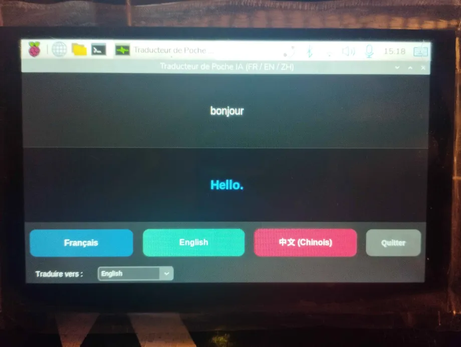
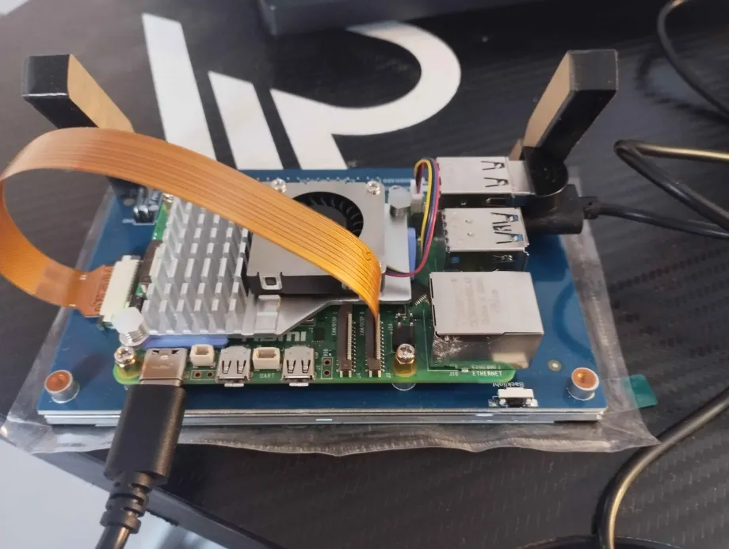

# Offline Translator



Un traducteur vocal hors-ligne (Offline) optimisé pour tourner localement sur un Raspberry Pi 5. Il capture la voix, la transcrit, la traduit et la vocalise (Text-to-Speech) sans aucune connexion internet.

## Technologies Utilisées
* `customtkinter` (Interface Graphique)
* `onnxruntime` (Exécution des modèles IA optimisés)
* `transformers` & `torch` (Gestion des modèles OpusMT d'Helsinki-NLP)
* `sounddevice` & `scipy` (Capture et traitement du flux audio du micro)

## Architecture Matérielle (Hardware)



Le projet est conçu autour d'une architecture embarquée autonome, optimisée pour le calcul IA local et la mobilité :

* **Unité de calcul :** Raspberry Pi 5 (Modèle 8 Go de RAM) – Choisi pour sa puissance de calcul brute permettant de charger et d'exécuter les modèles de Transformers et d'ONNX en mémoire vive sans latence.
* **Stockage :** Carte MicroSD Topelsel 32 Go – Utilisée actuellement pour stocker l'OS et les scripts. *Note : Une migration vers un boot sur clé USB 3.0 (Kingston 128 Go) est prévue dans la Roadmap pour améliorer les vitesses de lecture/écriture lors du chargement des modèles de langues lourds.*
* **Affichage & Interface Tactile :** Écran tactile LCD 5 pouces DSI iPistBit (Résolution 800x480, capacitif) – Connecté directement via la nappe souple DSI du Raspberry Pi 5 pour un affichage compact et une navigation fluide sans encombrer les ports HDMI.
* **Entrée Audio :** Microphone USB col-de-cygne ultra-compact – Configuré avec un correcteur de fréquence logiciel pour capturer proprement la voix et maximiser la précision de la transcription Whisper.
* **Sortie Audio :** Haut-parleur USB miniature ou mini-enceinte jack – Pour restituer la synthèse vocale (TTS) générée par le moteur Piper.
* **Alimentation :** Batterie externe (Power Bank) compatible USB-C Power Delivery (PD 30W minimum) – Indispensable pour fournir les 5V/5A stables requis par le Raspberry Pi 5 en plein calcul de modèles IA.


## Pipeline de traitement

L'application enchaîne 4 étapes clés en local à chaque pression de bouton :

```text
[Signal Vocal (Micro)] 
       ➔  1. Audio unique capturé (Format WAV)
       ➔  2. Transcription Textuelle par **Whisper Tiny**
       ➔  3. Traduction via **OpusMT** (avec bascule automatique par l'Anglais si FR ⇄ ZH)
       ➔  4. Génération du fichier audio par **Piper TTS**
[Diffusion Haut-Parleur]
